### 1. What is SQL?

SQL-запросы можно использовать для изменения структуры таблицы базы данных и ее индексов, а также для добавления, обновления и удаления строк данных.

Существует три основные категории команд SQL:
- Язык манипулирования данными (DML)
- Язык определения данных (DDL)
- Язык управления данными (DCL)

Каждый из этих типов команд может быть использован злоумышленниками для нарушения конфиденциальности, целостности и/или доступности системы. Продолжите урок, чтобы узнать больше о типах команд SQL и их связи с целями защиты.

Если у вас все еще возникают трудности с SQL и вам нужна дополнительная информация или практика, вы можете посетить сайт http://www.sqlcourse.com/ для бесплатного и интерактивного онлайн-обучения.

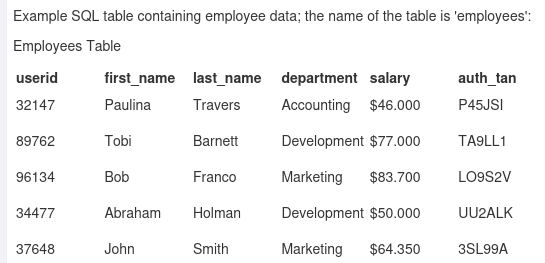

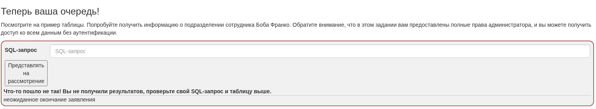

Получить информацию о подразделении сотрудника Боба Франко

**SQL query:** `select * from employees where first_name = 'Bob';`

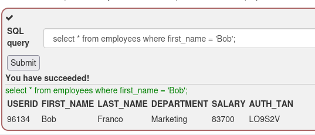

### 2. Data Manipulation Language (DML)

Команды DML используются для хранения, извлечения, изменения и удаления данных.
- SELECT — извлечение данных из базы данных
- INSERT — вставка данных в базу данных.
- UPDATE— обновляет существующие данные в базе данных.
- DELETE — удаление записей из базы данных

Изменить отдел Тоби Барнетта на «Продажи»

**SQL query:** `update employees set  department = 'Sales'  where first_name = 'Tobi';`

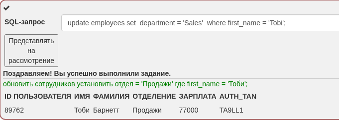

### 3. Data Definition Language (DDL)

Команды DDL используются для создания, изменения и удаления структуры объектов базы данных.
- CREATE — создание объектов базы данных, таких как таблицы и представления.
- ALTER — изменяет структуру существующей базы данных.
- DROP — удалить объекты из базы данных

**SQL query:** `ALTER TABLE employees ADD phone varchar(20);`

### 4. Data Control Language (DCL)

Команды DCL используются для реализации контроля доступа к объектам базы данных.

GRANT — предоставляет пользователю права доступа к объектам базы данных.

REVOKE - отзыв ранее предоставленных пользователю привилегий с помощью команды GRANT.

попробовать предоставить пользователю права доступа к таблице unauthorized_user: grant_rights 

**SQL query:** `GRANT ALL PRIVILEGES ON grant_rights TO unauthorized_user;`

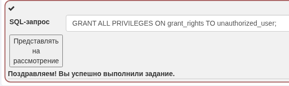

### 5. Try It! String SQL injection

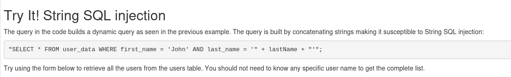

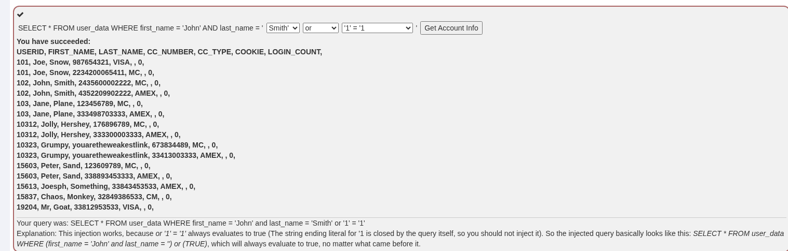

### 6. Try It! Numeric SQL injection

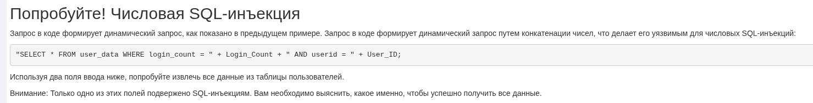

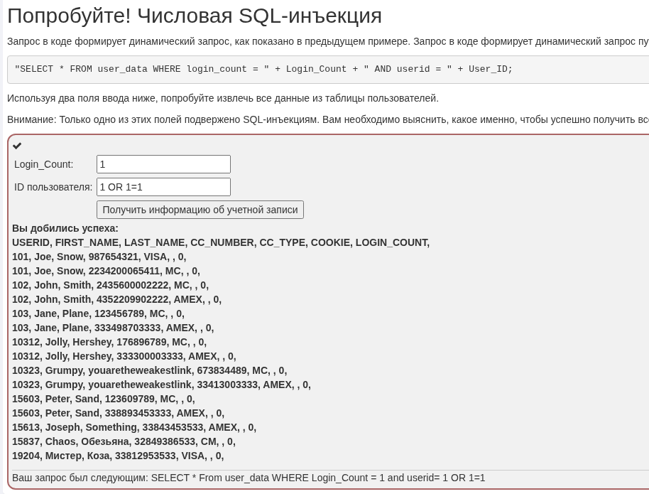

### 7. Compromising confidentiality with String SQL injection

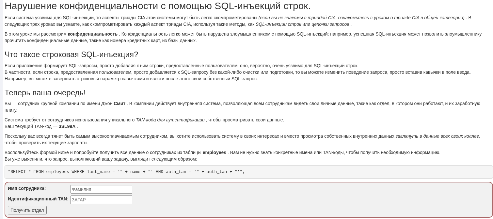

**SQL query injection**: Smith' or '1' = '1' --

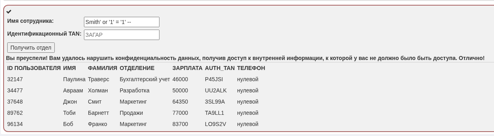

### 8 Compromising Integrity with Query chaining

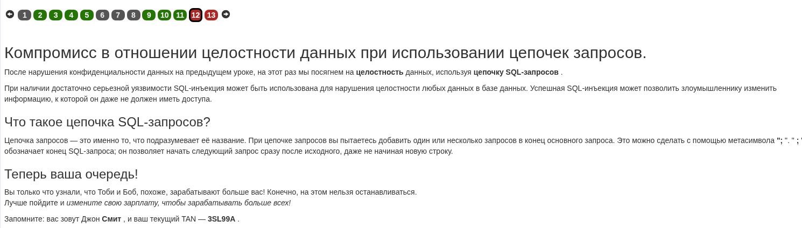

**SQL query:** `Smith'; UPDATE employees SET SALARY = 100000 WHERE userid = 37648; SELECT * FROM employees --`

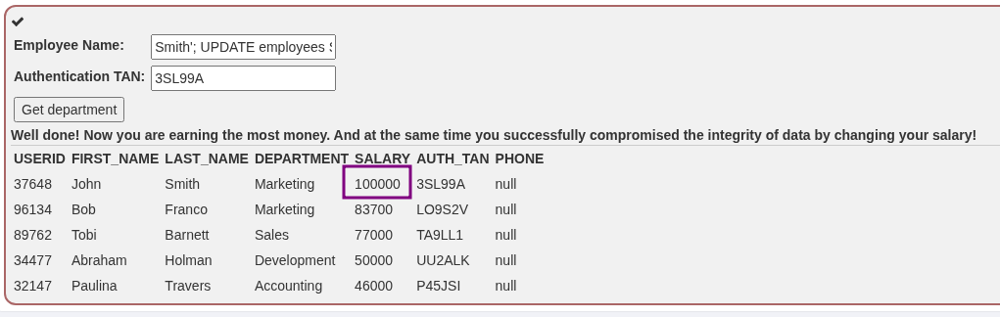

### 9. Compromising Availability

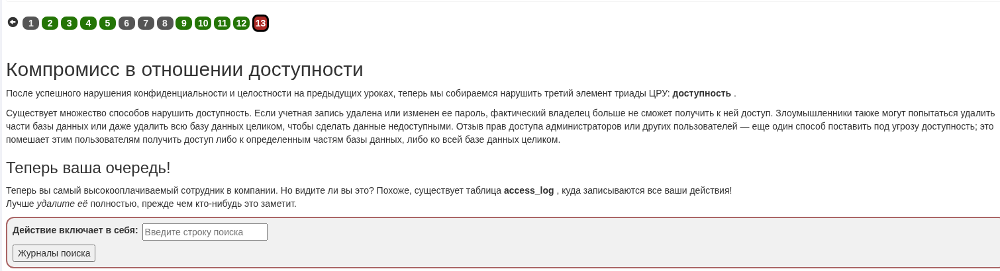

**SQL query:** 
```
'; drop table access_log;-- -
```

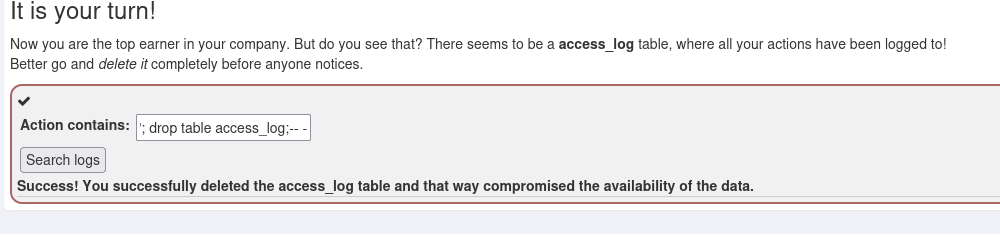

